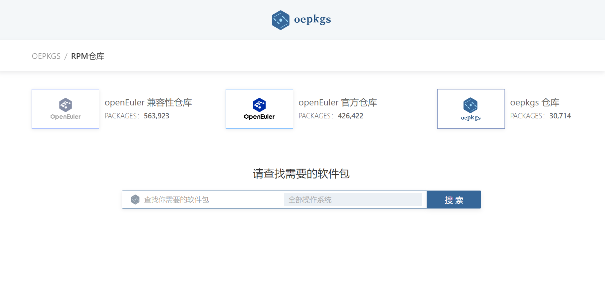
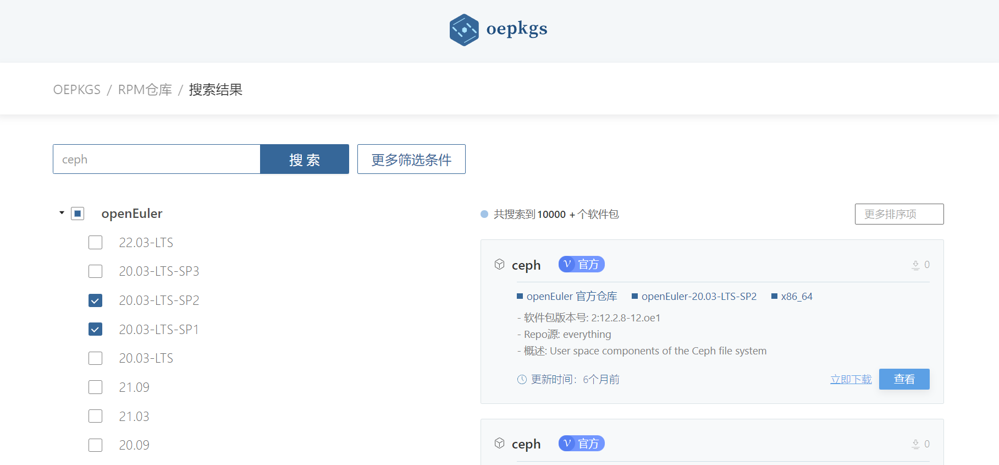
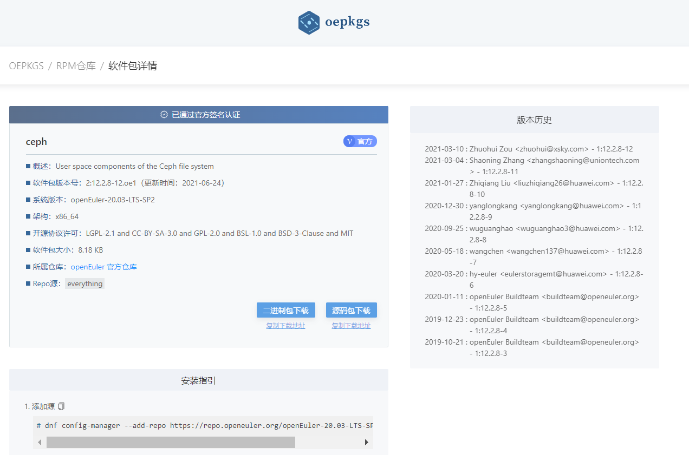

## 背景介绍
[oepkgs](https://oepkgs.net/zh/) 全称开放软件包服务(Open External Packages Service)，是一个为 openEuler 以及其他 Linux 发行版提供软件包服务和容器镜像服务的第三方社区。
目前 oepkgs [镜像源](https://repo.oepkgs.net/openEuler/rpm/)中已有2w+款软件包。oepkgs社区会对软件包进行构建测试，兼容性测试，并对 oepkgs 上软件包的[源码仓](https://gitee.com/src-oepkgs)进行生命周期管理。


## 内容概要

**1. oepkgs 仓库的现状**

**2. oepkgs 软件包的源码管理**

**3. oepkgs 社区的参与方式**

### oepkgs 仓库的现状

目前oepkgs 镜像源中已有2w+款软件包，用户可以在 https://search.oepkgs.net/search/ 上进行查询并下载使用，具体流程如下：

(1) 在查询框中输入待查找的软件包，这个查询页面基本上可以查询到所有在openEuler适配过的开源软件，不仅包括了oepkgs仓库，也包括了openEuler官方镜像源中的软件包。



(2) 在查找的所有软件包中进行筛选



(3) 在查看详情页面可获取软件包的基本信息以及安装指引



(4) 所有软件RPM包的镜像源路径：

https://repo.oepkgs.net/openEuler/rpm/

### oepkgs 软件包的源码管理

对于 oepkgs 软件包的源码管理，我们构建了一个 [src-oepkgs](https://gitee.com/src-oepkgs) 组织仓，作为第三方软件包代码托管平台，参考了 [src-openEuler](https://gitee.com/src-openeuler) 的仓库管理方式，同时创建了一个 [oepkgs-management](https://gitee.com/oepkgs/oepkgs-management) 仓库，包含组织仓src-oepkgs下仓库的配置文件，参考openEuler的 [community](https://gitee.com/openeuler/community) 仓库，仓库结构如下：
```
.
├── README
└── sig
    ├── bigdata
    │   ├── sig-info.yaml
    │   ├── README
    │   └── src-oepkgs
    │       ├── a
    │       │   └── xx.yaml
    │       ├── b
    │       ├── c
    │       └── d
    ├── undefined
    ├── virtual
    └── web
```
在openEuler社区，src-openEuler主要用于存放制作发布件所需的软件包：

https://gitee.com/src-openeuler/$project

src-openEuler下面仓库的创建都是由community仓库管理：

https://gitee.com/openeuler/community

而有一些主要应用在开发态、license不合规、长尾的、或是只有二进制文件的软件包，不适合引入openEuler社区，
计划将这些软件包引入到oepkgs仓库中，并将这些软件包的源码都存放在src-oepkgs下，src-oepkgs与src-openEuler类似：

https://gitee.com/src-oepkgs/$project

同样的，组织仓src-oepkgs也有一个负责仓库创建、演进的管理仓库，类似于community仓库：

https://gitee.com/openeuler/oepkgs-management

src-oepkgs与src-openEuler相比：

**相同点：**

1）以提PR的方式提交改动

2）可在仓库中提issue反馈问题

3）仓库功能与结构

**不同点：**

1）src-oepkgs会在形式上划分sig组，以便对软件进行分组，目前，实际维护者大都来自兼容性sig组成员。


### oepkgs 社区的参与方式

(1) 基于PR，在oepkgs-mangement仓库中创建配置文件，用于建仓

(2) 往步骤一生成的https://gitee.com/src-oepkgs/  仓库中补充构建所需源码文件

(3) 仓库的webhook将自动触发构建任务

详细流程可查看：[指导文档](https://gitee.com/openeuler/oec-application/blob/master/doc/software-compatibility/rpm%E6%9E%84%E5%BB%BA%E4%BB%A5%E5%8F%8A%E5%BB%BA%E4%BB%93%E6%B5%81%E7%A8%8B.md)


也可以通过 build.dev.oepkgs.net 网页去构建自己个人镜像源

详细流程可查看：[指导文档](https://gitee.com/openeuler/oec-application/blob/master/doc/%E5%8C%97%E5%90%91%E5%BC%80%E6%BA%90%E8%BD%AF%E4%BB%B6%E5%8C%85%E9%80%82%E9%85%8D%E8%BF%81%E7%A7%BB%E8%AF%A6%E7%BB%86%E6%8C%87%E5%AF%BC.md)