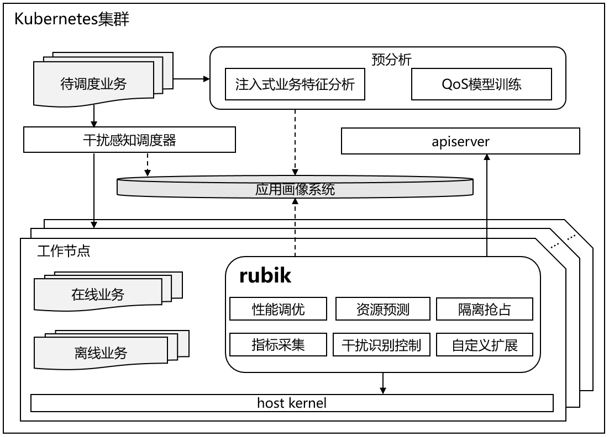
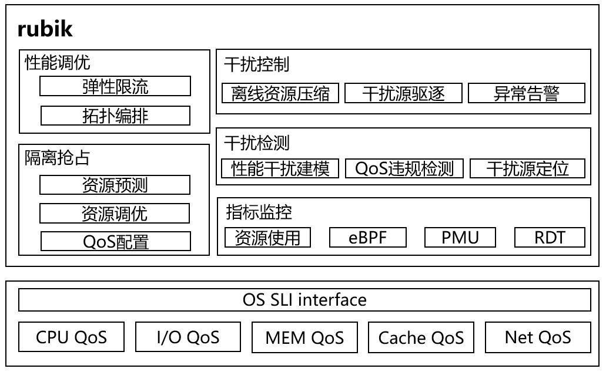

## 概述

​ 在云上业务类型和硬件资源越来越丰富的背景下，对云原生系统提出了更高的管理要求，例如在概论<sup>[1]</sup>中提到的资源利用率问题，服务质量保障问题，黑盒泛化问题，异构算力效率问题等等。为了让多样性业务和算力混部系统以最佳状态运行，Rubik 混部解决方案应运而生，在 Rubik 解决方案中，包括了集群感知调度、单机混部引擎（rubik）和内核隔离技术等多层次优化系统。本文是对 rubik 混部引擎的概要性介绍。

​ Rubik 字面意思为魔方，魔方由 Rubik 在 1974 年发明，故 Rubik 既是人名也指代魔方，在我们的解决方案中，Rubik 象征着能够将任务和算力资源有条不紊的管理起来。

​ rubik 混部引擎的愿景是提供一套自适应的单机算力调优和服务质量保障服务。包括如下能力目标：

- 兼容原生 kubernetes 系统：基于原生 kubernetes 的扩展接口进行能力扩展。
- 兼容 openEuler 系统：自动使能 openEuler 提供的增强特性（如内核分级资源隔离技术），对于其他 linux 发行版，由于存在部分内核特性缺失，仅提供受限管理能力。
- 注入式应用画像：通过干扰自动注入对业务进行画像标记，指导调度及运行时干扰识别控制。
- 节点及业务特征收集：上报节点及业务特征信息指导集群资源规划、调度策略优化，实现集群负载均衡、节点资源错峰互补使用。
- 运行时干扰识别控制：提供对关键业务性能干扰实时检测能力、干扰源快速定位能力以及干扰快速控制能力。
- 自适应动态调优：例如对关键业务性能优化，使其能能更高效稳定的运行；动态在离线资源配比调优，减少关键业务 QoS 违规等等。
- 支持自定义扩展：支持高级用户针对特定业务场景开发自定义扩展插件。



​ 图 1 rubik 混部引擎在系统中的位置

## 特性介绍

​ 在保障在线业务服务质量前提下实现资源利用率最大化提升是在离线混合部署的设计目标，rubik 混部引擎作为节点管理组件在整个混部解决方案中起到至关重要的作用，因此，rubik 混部引擎主要围绕资源利用率提升、QoS 保障展开。

​ 在资源利用率提升方面，rubik 提供以下机制指导集群资源调度、实现集群节点各维度资源均衡、错峰互补、干扰打散。

- 基于注入式应用画像指导作业调度的调度及重调度机制

​ 待调度作业通过干扰自动注入对业务进行画像标记， 分析工作负载的资源敏感度及压力度，调度阶段结合节点各维度资源（CPU、内存带宽、缓存带宽、磁盘带宽、网络带宽等）预测使用情况，指导集群节点资源统筹管理调度，不同资源密集型业务交错部署，均衡各维度平均资源利用率水平，同时也指导作业二次调度。

- 基于在线业务资源预测的节点资源超卖机制

​ 通过对在线业务的各维度资源采样，预测可/不可压缩资源使用情况并上报，为在线业务准确预留所需资源保障其 QoS 的同时，将未使用资源尽可能多地分配给离线业务，最大化离线的吞吐率，提升节点的资源利用率。

​ 在 QoS 保障方面，在混部作业的运行过程中，由于在离线作业竞争 CPU、缓存带宽、内存带宽、网络带宽、磁盘带宽等共享资源以及由于进程在不同 CPU 频繁切换及负载流量突发等情况，往往会导致业务性能受损，为了保障在线业务服务质量，防范关键业务 QoS 违规，rubik 混部引擎规划提供多重保障以提升工作负载的运行效率及稳定性。

- 第一道防线 - 基于内核特性的资源隔离抢占机制

​ openEuler Kernel 为了适配云原生混部场景，规划了 CPU、cache、blkio、Disk I/O、Network I/O 等资源的分级抢占能力，rubik 作为用户态组件，为在离线业务配置 QoS 优先级，使得当在线业务流量上升时，内核层面能为其快速抢占到所需资源，保障在线业务的服务质量，当在线业务的流量下降时，放宽对离线业务资源的限制，提高离线业务的吞吐率。

- 第二道防线 - 基于资源预测的在离线资源配比调优的预防机制

​ 通过对在线业务相关资源的监控采集，预测在线业务各资源的使用情况，并结合节点资源的使用情况，提前对资源进行规划，降低在线业务 QoS 违规风险。当预测在线业务资源需求变大时，根据节点资源的空闲情况，选择是否对离线业务资源的配比调整。

- 第三道防线 - 基于资源编排与弹性限流的自适应性能调优机制

​ 提供拓扑均衡&潮汐亲和性编排，减少进程在不同 CPU 的频繁切换、进程迁移开销以及访问远程 NUMA 导致性能抖动，同时应对关键业务流量突发，在保障整机负载水位安全稳定前提下，允许临时突破限制，协调资源进行自适应调整，快速解决或者缓解对应资源瓶颈，保障关键业务的服务质量。

- 第四道防线 - 基于指标监控的性能干扰检测控制的反馈机制

​ 在现有的计算机硬件体系结构中，除了 CPU、Memory、Disk、Network 等资源，还有诸如 Memory Bus、 System I/O Bus、 DMA Bus、MMU-TLB 等关键资源，且这些资源尚无对应的软硬件协同的资源隔离机制，无法实现应用级的隔离，仅仅对 CPU 等资源隔离抢占无法完全解决资源竞争带来的 QoS 违规问题。因此节点管理组件需要提供对关键业务的性能干扰分析，然而在实际的生产环境上，通常无法直接获得业务的 QoS 情况，因此，在预分析阶段对底层性能指标与上层应用 QoS 建模，在运行期根据模型实时检测评估 QoS 是否违规，并在出现 QoS 违规后基于异常指标定位干扰来源，最后对干扰源进行压制甚至驱逐来保障在线业务的服务质量。



​ 图 2 rubik 混部引擎特性

## 部署

​ 首先，需要准备一套基于 openEuler 22.03 完成部署的 kubernetes 集群，然后在 master 节点准备 rubik 的 yaml 部署文件，可以直接从 rubik 源码仓下载 example：

```bash
wget -O rubik-daemonset.yaml https://gitee.com/openeuler/rubik/raw/master/hack/rubik-daemonset.yaml
```

​ 下载之后，正确配置 yaml 里面的镜像地址，让它能够正确下载 rubik 镜像。

> 需要注意：
>
> 1. yaml 里需要正确配置 rubik 容器镜像的地址。假如前面采用的是 rubik 源码仓的 example，则需要修改 yaml 文件中的`image: rubik_image_name_and_tag` 为 `image: hub.oepkgs.net/cloudnative/rubik:latest`
> 2. yaml 中主要包含 ClusterRole、ClusterRoleBinding、ConfigMap、DaemonSet 四部分。其中 rubik 的启动配置参数包含在 ConfigMap 里，详细的配置说明可以参考[rubik 配置说明（](https://gitee.com/openeuler/rubik/blob/master/docs/config.md)https://gitee.com/openeuler/rubik/blob/master/docs/config.md[）](https://gitee.com/openeuler/rubik/blob/master/docs/config.md)

​ 然后，一键部署 rubik daemonset：

```bash
kubectl apply -f rubik-daemonset.yaml
```

​ 部署完成后，通过 kubectl 可以查询名为`rubik-agent`的 pod：

```bash
# kubectl get pods -A
NAMESPACE     NAME                                            READY   STATUS    RESTARTS   AGE
kube-system   rubik-agent-jhjdg                               1/1     Running   0          4d
```

## 使用示例

​ 以下演示如何启动一个 nginx Pod 并将对其设置为在线业务，rubik 为该业务使能 kernel 资源 QoS 保障机制。

​ 首先，需要在工作节点上使能 memory QoS 特性：

```bash
echo 1 > /proc/sys/vm/memcg_qos_enable
```

​ 然后，在部署文件 yaml 添加 volcano.sh/preemptable 的 annotation 以标识业务属性：

```bash
# cat nginx-online.yaml
apiVersion: v1
kind: Pod
metadata:
  name: nginx-online
  annotations:
    volcano.sh/preemptable: "false"   # volcano.sh/preemptable为true代表业务为离线业务，false代表业务为在线业务，默认为false
spec:
  containers:
  - name: nginx
    image: nginx
    resources:
      limits:
        memory: "200Mi"
        cpu: "1"
      requests:
        memory: "200Mi"
        cpu: "1"
```

​ 接着，部署 nginx 业务：

```bash
# kubectl apply -f nginx-online.yaml
# kubectl get pods
NAME            READY   STATUS    RESTARTS   AGE
nginx-online    1/1     Running   0          4d
```

​ 最后，查找并进入`nginx-online` Pod 对应的 cgroup 下，查看`cpu.qos_level`是否生效（在线业务为 0，离线业务为-1），具体运行效果可以查阅典型应用下的效果中案例 1<sup>[2]</sup>：

```bash
# cat /sys/fs/cgroup/cpu/kubepods/pod59f1cdfa-a0ad-4208-9e95-efbef3519c00/cpu.qos_level
0
```

## 展望

​ 在离线混合部署作为提升数据中心资源利用率的重要手段，得到学术界和工业界的关注，成为了研究的热点领域，但目前也面临着诸多技术挑战，尚有许多亟待解决的问题，如黑盒业务混部、异构资源混部等，需要在作业感知调度、性能干扰建模、资源隔离抢占等领域逐个突破。为了达成泛型混部及融合部署的目标，节点管理层面对关键业务进行性能干扰建模，提供精确的 QoS 量化模型，指导干扰实时检测与定位，并基于干扰检测与定位实现更精确的动态资源配比控制以及探索更精准普适的动态监测指标数据对应用画像以指导感知调度，这些方面具有着至关重要的作用，也是 rubik 后续研究的重点所在。

​ 本文简要介绍 rubik 混部引擎的愿景、目标、设计原则及特性机制，后续计划对其中涉及的性能调优技术，资源隔离抢占技术，干扰检测及控制技术等进行详细介绍，敬请期待！

## 加入我们

文中所述资源利用率提升技术，由 Cloud Native SIG、Kernel SIG 共同参与，其源码将在 openEuler 社区逐步开源。如果您对相关技术感兴趣，欢迎您的围观和加入。您可以添加小助手微信，加入对应 SIG 微信群。


## 系列文章回顾

[1] [openEuler 资源利用率提升之道 01 ： 概论](https://mp.weixin.qq.com/s/x9sdogEslRJJ5mDbs5bxgQ)

[2] [openEuler 资源利用率提升之道 02 ： 典型应用下的效果](https://mp.weixin.qq.com/s/anOTdRIufYaj5pl4hy1e_A)
