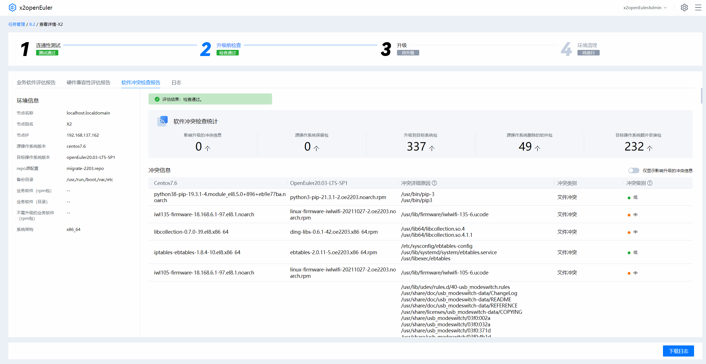
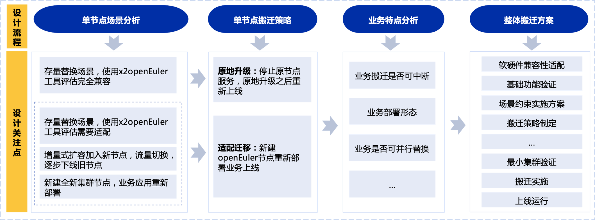
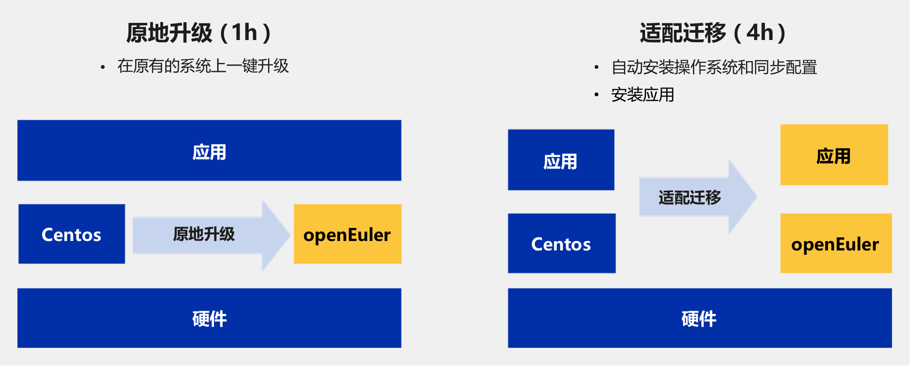
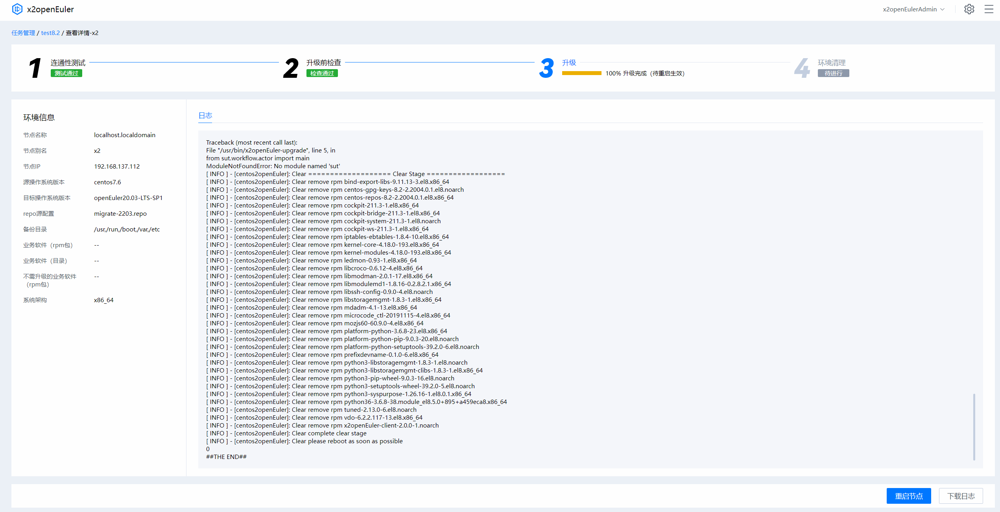

<DocAnchor/>

<h2 id='迁移概述' style="margin-top:0;">迁移概述</h2>

openEuler 提供端到端的迁移方案，包括成立迁移保障组织、迁移分析、方案设计、移植适配、迁移实施和测试上线六个阶段，同时通过 x2openEuler 工具的迁移评估和原地升级技术，将繁琐的迁移过程简化，实现了全场景业务的“简单、平稳、高效”的迁移。

[x2openEuler](/zh/migration/download/)是一款将源操作系统迁移到目标操作系统的迁移工具套件，具有批量化原地升级能力，当前支持将源 OS 升级至 openEuler 20.03。为解决客户升级操作系统过程中人工投入大、准确率低、无法批量化处理导致整体效率低下的痛点，x2openEuler 工具提供简单易用的操作界面，您可以批量添加待升级节点进行迁移分析，设计迁移方案并对兼容性问题进行迁移适配，最后对已适配的待升级节点批量升级，实现端到端的无感迁移。

## 迁移流程

基于 openEuler 的迁移方案，包括成立迁移保障组织、迁移分析、方案设计、移植适配、迁移实施和测试上线六个阶段。

## 成立保障组织

在进行操作系统迁移前，客户业务部门、IT 部门、维护部门以及 OSV、ISV 需要成立迁移保障组织，为操作系统迁移提供技术支持和组织保障。

## 迁移分析

迁移保障组织成立后，公司内部收集需要迁移的业务名称、迁移诉求、软件栈、业务部署形态、服务器硬件信息，形成迁移项目全景图。根据迁移项目全景图，按照业务的提供商、操作系统和硬件环境进行筛选，指定业务的迁移优先级。最后，可参考[x2openEuler 用户指南](https://docs.openeuler.org/zh/docs/20.03_LTS_SP1/docs/thirdparty_migration/x2openEuler-Userguide.html)对操作系统的硬件、软件和配置进行兼容性评估，对不兼容的软件包需要进行补全或者替代，给出兼容性报告供后续步骤使用。

x2openEuler 能够在升级前进行如下三个方面的评估，并生成兼容性评估报告：

- 软件评估

  通过识别应用软件依赖包信息清单，对应用软件进行扫描评估，并生成评估报告。

* 配置收集与评估

  支持收集用户环境数据并生成配置文件，支持收集硬件配置、配置接口、内核选项配置参数、系统配置参数、环境变量、服务、进程、端口、命令接口、系统调用项以及设备驱动接口等信息，完成配置信息分析评估。

- 硬件评估

  评估运行环境的整机（x86/aarch64）、整机板卡（RAID/NIC/FC/IB/GPU/SSD/TPM/AI）是否在[openEuler 兼容性列表](https://www.openeuler.org/zh/compatibility/)中。

## 方案设计

根据兼容性报告和业务迁移的优先级，结合业务场景设计每个业务节点的迁移策略，再根据业务的部署形态、是否可并行替换、是否可中断等自身特点定制整体搬迁方案。x2openEuler 能够在升级前进行如下三个方面的评估，并生成兼容性评估报告：

    

      

        <o-icon><icon-book></icon-book></o-icon>
        
说明

      

      

        OS迁移可分为同架构迁移和异架构迁移，异架构迁移需先完成应用软件的跨架构迁移。
      

    

### 迁移优先级

面向不同的业务属性，可制定不同的迁移优先级，梳理以下三种业务属性供参考。

- 按业务语言分类：

  − Java 类：java 类应用通过 jdk 运行环境屏蔽、兼容性较好，jdk 8 以上版本高优先级选择迁移。

  − C 语言类：根据兼容性评估结果，兼容性情况下，高优先级选择；需要移植的部分，优先级选择。

  − Python 类：python 3/python2 类业务，高优先级选择；

* 按业务部署形态分类：

  − 集群类业务，高优先级选择。

  − 主备类业务，高优先级选择。

  − 单机类业务，低优先级选择。

- 按业务状态分类：

  − 无状态业务（不涉及本地存储、配置数据），高优先级选择。

  − 有状态业务（涉及本地数据），低优先级选择。

### 迁移场景

根据业务系统的情况 ，确定对应的迁移场景，制定迁移方案和实施。主要包含以下三种迁移场景：

- 新建：业务为全新业务时，采用新操作系统。

- 扩容：业务节点已运行一段时间，需在此基础上扩容新节点，采用新操作系统。

- 存量替换：业务节点已运行一段时间，将原操作系统替换为新操作系统。

## 迁移适配

在迁移分析阶段生成的 x2openEuler 兼容性报告中详细列出了需要适配的软件，请根据报告详情进行适配，并在迁移后的新系统上重新部署。典型软件移植适配可参考[移植案例](/zh/migration/transplantation-cases/)。

- 软件适配

  a.&nbsp; 应用软件适配：需联系软件厂家或自研软件责任方进行适配。

  b.&nbsp; OS 软件适配：引入评估报告中缺失的依赖包，具体操作请参见[软件兼容性适配流程](https://gitee.com/openeuler/oec-application/blob/master/doc/openEuler%E7%A4%BE%E5%8C%BA%E5%BC%80%E6%BA%90%E8%BD%AF%E4%BB%B6%E9%80%82%E9%85%8D%E6%B5%81%E7%A8%8B.md)完成包引入。适配完成后，将软件包引入至社区软件仓库及根据需要刷新软件兼容性清单（可选）。

    

      

        <o-icon><icon-book></icon-book></o-icon>
        
说明

      

      

        对于兼容的软件可直接使用。
      

    

- 配置收集与适配

  使用 x2openEuler 的配置迁移功能，工具自动分析系统的 4 种配置：服务配置，网络配置，内核配置，挂载配置。用户需结合自身实际业务诉求及调优策略不同，对各项工具展示需要同步的配置项进行分析，选择需要修改的配置，之后由工具生成自动化脚本，实现一键配置同步。

* 硬件适配

  a.&nbsp; 查看硬件兼容性评估报告中“待确认”的硬件类型。

  b.&nbsp; 引导硬件厂家或社区开展适配，具体操作请参见[硬件兼容性测试服务。](https://www.openeuler.org/zh/compatibility/hardware/)

  c.&nbsp; 适配完成后，将适配驱动发布至[软件所仓库](https://repo.oepkgs.net/openEuler/rpm/)，并同步刷新兼容性清单。

  d.&nbsp; 当“是否在兼容清单”的状态变为“是”时，表示硬件已经过兼容性认证。

## 迁移实施

#### 注意事项

- 迁移实施对现网业务可能有影响，请提前规划迁移时间和所需资源。

- 针对存量迁移场景，迁移涉及到软件包的升级或重新安装，实施迁移前请做好系统备份。

- 当前不支持 32 位操作系统，如果有 32 位应用支持，请提前联系社区或 OSV 厂家确认。

- 对现网业务建议由专业人员实施迁移，并联系操作系统厂家运维人员提供技术支撑。

#### 注意事项

openEuler 为用户提供两种迁移路径：

- 原地升级方案：将原有的操作系统直接升级到目标操作系统，系统的配置，业务数据等不需要重新部署，可直接复用。

- 适配迁移方案：在新的硬件或原有硬件中，重新安装操作系统，重新部署业务对旧节点进行替换。

建议用户优先使用 x2openEuler 工具对软件的兼容性进行评估，根据业务需求选择不同的迁移路径。在制定好整体的搬迁方案后，即可开始进行业务迁移，根据 x2openEuler 兼容性报告，完全兼容的业务使用 x2openEuler 工具直接进行原地升级，最大程度保留原有业务和配置不变。原地升级可参考[x2openEuler 用户指南](https://docs.openeuler.org/zh/docs/20.03_LTS_SP1/docs/thirdparty_migration/x2openEuler-Userguide.html)进行操作。适配迁移包括停止业务、备份隔离、系统部署、配置同步、应用部署、业务割接等步骤，请联系我们提供详细的技术指导。

## 测试与上线

在业务系统迁移完毕后，可以通过原有的业务系统测试用例和方法对业务进行单元测试和系统集成测试，也可以抽取核心功能模块进行快速测试，测试通过后方可上线。上线 1~3 个月时间内，需要持续监控业务运行情况，确保业务系统平稳过度，运行良好。

根据测试提供的性能数据，判断是否有必要进行性能调优，欧拉开源社区提供[性能调优工具 A-Tune](https://www.openeuler.org/zh/other/projects/atune/)，可以帮助企业快速进行性能调优。

安全漏洞更新维护是业务上线后面临的主要问题和风险之一。[openEuler 成立了安全委员会、制定了严格的漏洞处理流程，让您安全无忧。](https://www.openeuler.org/zh/security/vulnerability-reporting/)

