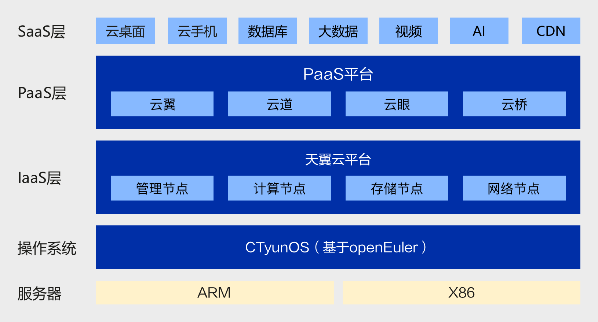

目前 openEuler 提供主流场景的迁移实践，包含大数据、分布式存储、虚拟化、容器、数据库软件，已经成功支撑多个行业用户完成迁移工作。各场景的迁移实践可[联系我们](/zh/migration/contact/)获取。

[天翼云全场景业务无缝迁移至基于 openEuler 的自研操作系统 CTyunOS](https://baijiahao.baidu.com/s?id=1744113308957850456)

[浙江移动完成了 openEuler 的大规模迁移部署](https://www.cnii.com.cn/rmydb/202109/t20210923_311404.html)

